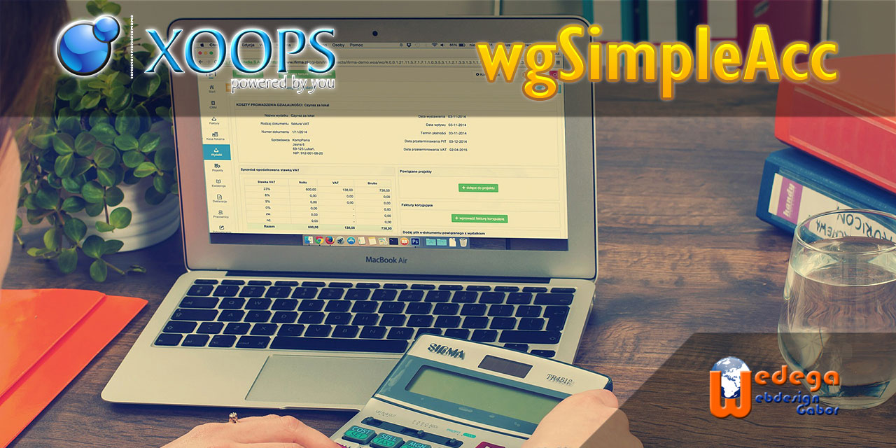

## wgSimpleAcc – Simple Accounting Module for  [XOOPS CMS 2.7.0+](https://xoops.org)

**wgSimpleAcc** is a lightweight and user-friendly accounting module for XOOPS CMS designed for small organizations, clubs, associations, and community groups.

The module helps administrators manage incomes and expenses, organize financial data, and generate balances through an intuitive interface integrated directly into XOOPS.

Built for XOOPS 2.7.0+ and compatible with modern PHP versions, wgSimpleAcc provides a practical solution for communities that need simple bookkeeping without the complexity of enterprise accounting software.

### Main features:

- Income and expense management
- Support for:
    - departments / assignments
    - assets
    - accounts
    - clients
    - taxes
    - currencies
- Fast balance creation and financial overview
- Detailed permission management:
    - submit permissions
    - approval permissions
    - viewing permissions
- Upload and management of related documents and images
- Custom output templates for flexible presentation
- Financial visualization using Chart.js
- Responsive frontend templates
- Bootstrap-based interface for modern XOOPS themes
- Designed for clubs, sports communities, and small businesses
- PHP 8 ready

Most of the templates on user side are fully responsive, but for proper displaying you must use a Bootstrap theme.

### Use Cases

wgSimpleAcc is especially suitable for:

- Sports clubs
- Non-profit organizations
- Small associations
- Community groups
- Small businesses requiring lightweight bookkeeping
- Internal budget tracking for XOOPS-powered portals

#### extras/themes:

wgSimpleAcc provides following themes:
* wgsa_startmin_bt3: Bootstrap 3 theme, this startmin theme isn't supported anymore
* wgsa_startmin_bt4: Bootstrap 4 theme, this startmin theme isn't supported anymore
* xbootstrap: Bootstrap 3 theme, this theme isn't supported anymore
* xswatch4: Bootstrap 4 theme

Next versions will be updated to Bootstrap 5.

### Require:

- XOOPS 2.5.11 (2.7.0 recommended);
- XOOPS Admin 1.2;
- PHP 7.4 or higher (8.4 recommended);
- MySQL 5.7.8;
- Bootstrap-based XOOPS theme recommended

#### Demo:
* https://wgsimpleacc.wedega.com/

### Additional Information

The module includes responsive templates and dashboard-style financial visualization to simplify accounting management for non-technical users.

It also supports custom templates, enabling developers and site administrators to adapt the output to their own design requirements.

### Links

- GitHub Repository: https://github.com/XoopsModules25x/wgsimpleacc
- XOOPS CMS: https://xoops.org
- Demo: https://wgsimpleacc.wedega.com/

#### Tutorial:
 Tutorial: coming soon on [GitBook](https://xoops.gitbook.io/wgsimpleacc-tutorial/).
To contribute to the Tutorial, [fork it on GitHub](https://github.com/XoopsDocs/wgsimpleacc-tutorial)

#### Translation:

Please visit us on https://xoops.org

Current and upcoming "next generation" versions of XOOPS CMS are being crafted on GitHub at: https://github.com/XOOPS
